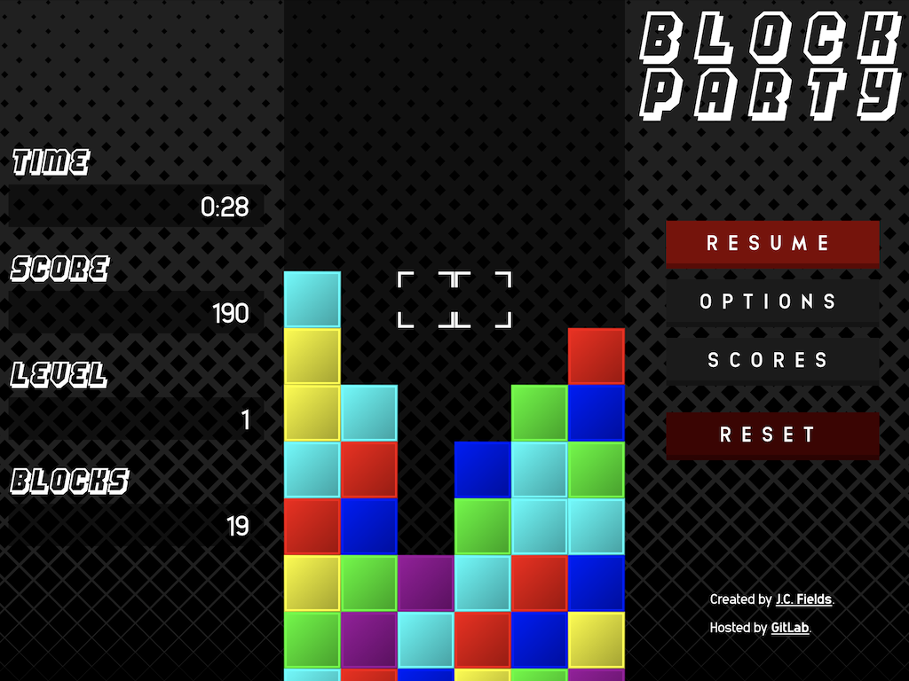

# block-party

[*Block Party*](https://jcfieldsdev.github.io/block-party/) is a clone of the puzzle game *Tetris Attack*. Written in JavaScript. *Tetris Attack* was originally released for the Super NES in 1995.

## Guide

### Gameplay

*Tetris Attack* is a tile-matching puzzle game. Rows of colored blocks continuously rise from the bottom of the well and push the existing stack of blocks up. Use the cursor to rearrange the blocks. Match three or more blocks of the same color in a row or column to eliminate them. The game ends if the stack of blocks is pushed past the top of the well.

Blocks fall under the effect of gravity if there is empty space underneath them. Because of this, it is possible to set up chain reactions for additional points. Each "wave" of a chain reaction increases the number of points rewarded multiplicatively. The *Score* field shows the current number of points.

The level of the game, visible in the *Level* field, increases when a certain number of blocks are eliminated, which also increases the rate at which the rows rise. The number of blocks that have been eliminated is tracked in the *Blocks* field.

### Controls

Press the `Up`, `Down`, `Left`, or `Right` arrow keys to move the cursor. Press `Space` or `End` to swap the blocks under the cursor.

Press either `Shift` key to push a new row into the well.

Press the `Enter` key to pause or resume the game.

The `W`, `A`, `S`, and `D` keys can also be used instead of the arrow keys.

### Options

- **Colors**—This determines the number of possible block colors. More colors correspond to a higher difficulty level. The default is 6 colors.
- **Level**—The starting level. Rows rise at a faster rate at higher levels. Each level also has a different background. There are 10 levels.
- **Height**—The starting height. This setting determines the number of rows the game starts with. The default is 7 rows.
- **Mode**
  - The goal of the *Standard* mode is simply to play as long as possible and earn the greatest amount of points before losing.
  - In *Time Attack* mode, the timer counts down from 5 minutes. The challenge is to attain the highest score possible before the timer expires.

There is a separate high score table for each mode and for each difficulty level (i.e., number of colors).

## Acknowledgments

Image sources: [cyan](https://all-free-download.com/free-vector/download/geometric-pattern-template-delusion-symmetrical-design_6839150.html), [green](https://all-free-download.com/free-vector/download/geometrical-pattern_119848.html), [grey](https://www.vecteezy.com/vector-art/165064-vector-abstract-halftone-background), [orange](https://www.vecteezy.com/vector-art/97469-triangle-pink-camo-vector), [teal](https://all-free-download.com/free-vector/download/geometric-pattern-colorful-flat-symmetric-delusion-decor_6845633.html),  [white](https://www.vecteezy.com/vector-art/256509-modern-gray-geometric-pattern-vector-design).

Uses [Animosa](https://www.brumale.xyz/animosa/) font by [Stefano Giliberti](https://www.brumale.xyz/) and [Hang the DJ](https://www.dafont.com/hang-the-dj.font) font by [Pizzadude](http://pizzadude.dk/).

## Authors

- J.C. Fields <jcfields@jcfields.dev>

## License

- [MIT license](https://opensource.org/licenses/mit-license.php)

## See also

- [*Columns*](https://github.com/jcfieldsdev/columns)—Another puzzle game on which this one is based.
